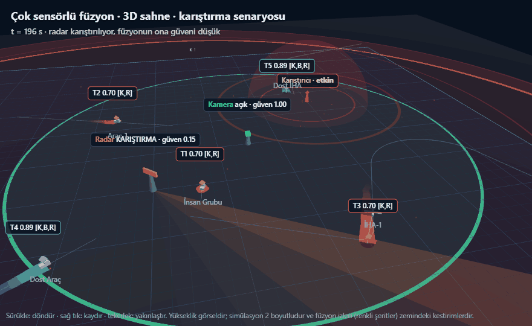
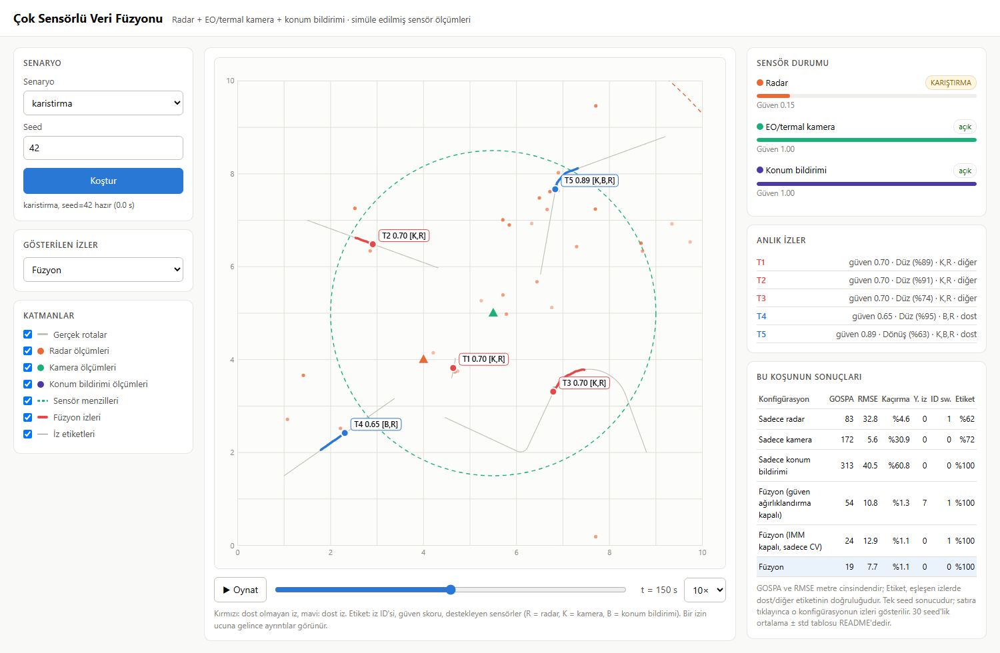
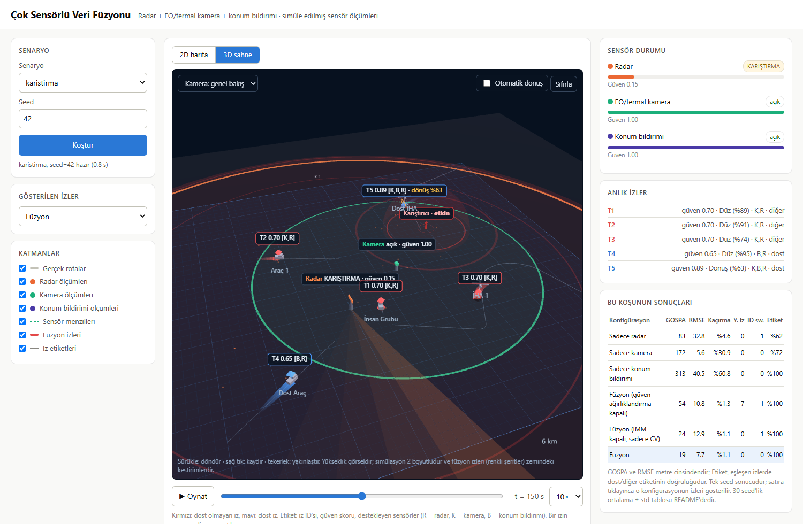
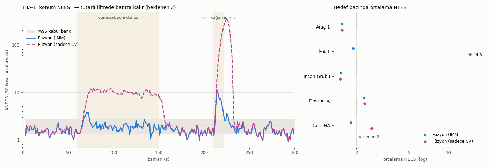

# Çok Sensörlü Veri Füzyonu

[](https://github.com/Goktugelbir/Cok-Sensorlu-Veri-Fuzyonu/actions/workflows/testler.yml)

*Harekât sahasında durumsal farkındalığın artırılması*

Radar, EO/termal kamera ve konum bildirimi sensörlerinden gelen simüle edilmiş
konum ölçümlerini birleştirerek tek bir **ortak durum resmi** oluşturan ve
füzyonun tek sensöre göre kazancını ölçen bir Python projesi [1, 5]. Sonuçlar ayrıca
yerel bir web arayüzünde 2D harita ya da 3D sahne olarak etkileşimli izlenebilir
([Web arayüzü](#web-arayüzü)).



*Karıştırma senaryosu, 196-226 s (seed 42), web arayüzünün 3D sahnesi. Radar
karıştırılıyor ve füzyonun ona güveni düşük (kırmızı kubbe ve parazit
dalgaları). 210. saniyede İHA-1 12 saniyede 90° sağa kırılıyor; IMM filtresi
dönüş modeline geçiyor (sarı halka) ve iz kopmadan devam ediyor. Karıştırma
220. saniyede bitince radarın güveni yeniden yükseliyor. Yükseklik görseldir
(bkz. [3D sahne](#3d-sahne)).*

> **Kısaca:** Bir sahada hareket eden beş hedefi üç farklı sensör izliyor:
> uzağı gören ama kaba ölçen bir radar, hassas ama sadece yakını gören bir
> kamera ve sadece dost birliklerin kendi konumunu bildirdiği bir sistem.
> Her biri tek başına eksik kalıyor: Radar gürültülü, kamera hedeflerin üçte
> birini hiç görmüyor, konum bildirimi dost olmayan hedefleri göremiyor. Bu proje, üç
> sensörün ölçümlerini birleştirip tek ve güvenilir bir "kim nerede" resmi
> çıkarıyor. Sis, radar karıştırma ve sensör arızası gibi durumlarda da
> çalışıyor; hedeflerden biri sert bir dönüş yaptığında izi kaybetmemek için
> iki hareket modelini birlikte kullanan bir IMM filtresinden yararlanıyor. Sonuç olarak füzyon, genel başarım ölçütü GOSPA'da (konum
> hatası, kaçırılan ve sahte hedefler birlikte), dört senaryonun hepsinde ve
> 30 tekrarın 30'unda tek başına en iyi sensörden daha iyi bir durum resmi
> veriyor. Sadece konum hatasına bakan RMSE'de ise yakın hedefleri gören kamera
> çoğu senaryoda daha düşük kalıyor (bkz. [Yorum](#yorum)). Bu bulgu, ayarlamada hiç kullanılmamış ikinci bir 30'luk tekrar setinde de
> doğrulandı. Füzyon izleri ayrıca dost/diğer etiketini de her koşuda
> doğru taşıyor ve bildirdikleri belirsizlik gerçek hatalarıyla uyumlu
> (filtre tutarlılığı, bkz. [NEES](#filtre-tutarlılığı-nees)). Proje bir **simülasyon demosudur**; gerçek sensör verisi
> kullanmaz (bkz. [Sınırlamalar](#sınırlamalar)).

> **In English:** A Python demo that fuses simulated radar, EO/IR camera and
> blue-force position reports into a single tactical picture. It covers time
> alignment of delayed measurements, online bias estimation, Mahalanobis gating
> with optimal assignment, IMM filtering (constant velocity + EKF coordinated
> turn) and NIS-based sensor trust. Across four scenarios (normal, fog,
> jamming, sensor loss) and 30 Monte Carlo runs, fusion beats the best single
> sensor in GOSPA in 30/30 runs per scenario. The result is confirmed on a
> held-out seed set. Two ablations show that sensor trust prevents false tracks
> under jamming, and that IMM beats a single constant-velocity filter in 30/30
> runs per scenario by keeping track through a sharp 90° turn. A NEES
> consistency check shows that the IMM's reported uncertainty matches its
> actual error (ANEES 1.8, expected 2), while the constant-velocity filter's
> NEES on the manoeuvring UAV is about 7× the expected value (overconfident).


*Üst satır (başarılı örnek, sis): Kamera sisten etkilenince tek başına hedeflerin
%65'ini kaçırıyor. Füzyon radar ve konum bildirimiyle bu açığı kapatıyor ve en
düşük RMSE'yi veriyor. Alt satır (zorlu örnek, sensör kaybı): Radar ve kamera
150-170 s arasında aynı anda kapalı kalıyor. Bu sürede sadece dost birlikler
izlenebiliyor; diğer hedeflerin izleri kopuyor ve geri geldiklerinde yeni ID
alıyor. Kırmızı: dost olmayan iz, mavi: dost iz, gri: gerçek rota.
Figür seed=42 örnek koşusundandır; istatistikler için [Sonuçlar](#sonuçlar).*

## Amaç

- 10 km x 10 km'lik bir sahada hareket eden 5 hedefi (2'si dost) farklı
  özelliklere sahip üç sensörle izlemek,
- sensör ölçümlerini zaman, bias ve güven açısından hizalayıp tek bir iz
  listesinde birleştirmek,
- füzyonun tek sensörlere göre kazancını dört senaryoda (normal, sis,
  karıştırma, sensör kaybı) sayısal olarak göstermek.

## Saha ve sensörler

| Hedef | Tür | Rota |
|---|---|---|
| Araç-1 | diğer | düz, sabit 10 m/s |
| İHA-1 | diğer | 22 m/s, uzun sola dönüş ve ardından sert sağa kırılma (210-222 s, 12 s'de 90°) |
| İnsan Grubu | diğer | 1.5 m/s, hafif kıvrımlı |
| Dost Araç | **dost** | düz, hız değiştiren (8 → 16 → 5 m/s) |
| Dost İHA | **dost** | 18 m/s, 60° dönüş, ardından yavaşlama |

| Sensör | Konum / menzil | Gürültü (1σ) | Hız | Gecikme | Özel durum |
|---|---|---|---|---|---|
| Radar | (4, 4) km, 8 km | 12 m + 2 m/km | 1 Hz | 0.6-0.7 s | %90 tespit, tarama başına ~0.5 yanlış alarm |
| EO/termal kamera | (5.5, 5) km, 3.5 km | 3 m + 4 m/km | 5 Hz | 0.3-0.35 s | sis: menzil x0.65, gürültü x3, tespit %50 |
| Konum bildirimi | sadece dostlar | 3 m | 0.5 Hz | 1.5-1.7 s | sabit bias (35, -20) m, kimlik taşır |

Sensörler aynı anda ölçmez (her birinin farklı bir faz kayması vardır). Her
ölçüm, sensörün beyan ettiği nominal gürültü kovaryansını taşır. Sis veya
karıştırma bu beyanı değiştirmez; bozulmayı füzyon merkezinin kendisi fark
etmek zorundadır.

## Yöntem

1. **Zaman senkronizasyonu:** Füzyon merkezi, en büyük gecikmeden uzun sabit
   bir pencere (2 s) kadar geriden çalışır. Pencere içindeki ölçümler alınış
   zamanına göre sıralanır, her taramadan önce bütün izler Kalman tahminiyle
   tam o ana taşınır ve sonunda 0.2 s'lik ortak zaman adımına hizalanır. Bu
   sayede gecikmeli ve sırası bozuk gelen ölçümler doğru anda işlenir [1].
2. **Bias düzeltme:** Konum bildirimindeki sabit sapma, radar ve/veya kamerayla
   desteklenen olgun izlere göre hesaplanan artıkların ağırlıklı ortalamasıyla
   kestirilir. Kestirim tamamlanana kadar bu ölçümler izi güncellemez; sadece
   kimlik etiketi ve bias örneği sağlar [1].
3. **İz ilişkilendirme:** Mahalanobis kapılama (χ², %99.9) [1] uygulanır;
   iz-ölçüm atama problemi `scipy.optimize.linear_sum_assignment` [4] ile
   çözülür. Bu fonksiyon Crouse'un [3] tarif ettiği en kısa artırma yolu
   yöntemini uygular; Macar algoritmasıyla aynı optimal atamayı bulur.
   Atanmayan ölçümden aday iz başlatılır; güven ağırlıklı 3 vuruşla iz onaylanır. Aday iz 2.5 s,
   onaylı iz 6 s güncellenmezse silinir. Çakışan çift izler birleştirilir [1].
4. **IMM filtresi** [1, 9]**:** Her iz, iki hareket modelini birlikte çalıştıran
   bir IMM (Interacting Multiple Model) filtresi taşır: sabit hız (CV, durum
   `[x, y, vx, vy]`, beyaz ivme σ = 1 m/s²) ve dönüş hızını da kestiren
   koordineli dönüş (CT, durum `[x, y, vx, vy, ω]`). CT modeli doğrusal
   olmadığı için genişletilmiş Kalman filtresiyle (EKF) [2] işlenir. Modellerin
   olasılıkları, Markov geçiş matrisi ve her ölçümün iki modele göre
   olabilirliğiyle güncellenir; çıktı iki modelin olasılık ağırlıklı
   birleşimidir. Füzyon merkezi tahmini düzensiz aralıklarla (her sensör
   taraması ve her 0.2 s'lik adımda) çağırdığı için geçiş matrisi 1 saniye
   için tanımlanır ve her adımda geçen süreye (dt) göre ölçeklenir. Böylece
   model olasılıkları tahmin sıklığından bağımsız kalır. Düz giden hedeflerde
   CV, İHA-1'in sert kırılmasında CT öne çıkar (bkz. [Yorum](#yorum)).
5. **Sensör güveni ve çelişki çözümü:** Her sensör için normalize inovasyon
   karesinin (NIS) [1, 6] hareketli ortalaması tutulur. Ortalama tolerans değerini (4)
   aşarsa sensörün güveni düşer ve ölçüm kovaryansı `R / güven` olarak
   büyütülür. Böylece karıştırılan radar ya da sisteki kamera, çelişkide daha
   az söz sahibi olur. Güveni düşük sensörün vuruşları da onaya daha az katkı
   verir, bu da karıştırmanın ürettiği sahte izleri engeller. Bu yaklaşım,
   ölçüm gürültüsü kovaryansını çevrimiçi kestiren uyarlamalı Kalman
   filtrelerinin [6] basitleştirilmiş bir biçimidir.
6. **İz güven skoru:** `1 - Π(1 - katkı_s · güven_s · e^{-Δt_s/5})`. Her iz, son
   3 saniyede kendisini destekleyen sensörlerin listesini taşır (animasyonda
   `[R,K,B]` = radar, kamera, konum bildirimi).

**Değerlendirme:** Füzyon zamanında her saniye onaylı izler gerçek hedeflere
optimal atamayla (`linear_sum_assignment`) eşlenir (eşik 250 m).

- **GOSPA** [8] (p = 2, α = 2, c = 250 m): Her anda eşleşen çiftlerin konum
  hatası ile kaçırılan ve sahte hedeflerin her biri için c²/2 cezası tek bir
  uzaklıkta toplanır; tablo zaman ortalamasını verir. Kapsama ve doğruluğu
  birlikte ölçtüğü için ana karşılaştırma ölçütüdür.
- **RMSE:** Sadece eşleşen iz-hedef çiftlerinin konum hatası (kaçırılan
  hedefleri cezalandırmaz).
- **Kaçırma oranı:** İz atanmamış (hedef, an) çiftlerinin oranı.
- **Yanlış iz:** Ömrünün yarısından fazlasında hiçbir hedefe eşlenmeyen iz.
- **ID switch:** Bir hedefi izleyen iz kimliğinin değişmesi.
- **Etiket doğruluğu:** Eşleşen (hedef, an) çiftlerinde izin dost/diğer
  etiketinin hedefin gerçek türüyle aynı olma oranı. Konum bildirimi desteği
  almamış bir iz "diğer" sayılır.
- **Filtre tutarlılığı (NEES)** [1]: Eşleşen her iz için konum hatası `e`,
  filtrenin kendi bildirdiği kovaryans `P` ile normalize edilir:
  `NEES = eᵀ P⁻¹ e`. Tutarlı bir filtrede bu değer 2 serbestlik dereceli
  ki-kare dağılır (ortalaması 2). 30 koşunun ortalaması (ANEES) için her anda
  %95'lik bir kabul bandı hesaplanır. Bandın üstü "filtre kendine fazla
  güveniyor", altı "fazla temkinli" demektir. Ayrıntılar:
  [`src/tutarlilik.py`](src/tutarlilik.py).

Tek sensör sonuçları, aynı füzyon hattının sadece o sensörle çalıştırılmasıyla
elde edilir.

## Kurulum

```bash
git clone https://github.com/Goktugelbir/Cok-Sensorlu-Veri-Fuzyonu.git
cd Cok-Sensorlu-Veri-Fuzyonu
python -m pip install -r requirements.txt
```

Python 3.10+ ile numpy, scipy, matplotlib ve pillow gerekir; testler için pytest.

## Çalıştırma

```bash
python main.py --senaryo sis        # tek senaryo: normal | sis | karistirma | sensor_kaybi
python main.py --hepsi              # tüm senaryolar, 30 seed (~7 dk, çok çekirdekli)
python main.py --hepsi --tekrar 5   # daha az koşu, daha hızlı
python main.py --hepsi --gif-yok    # animasyonsuz
python main.py --hepsi --ilk-seed 100 --gif-yok   # bağımsız doğrulama (seed 100-129)
python -m pytest                    # birim testleri
python web.py                       # web arayüzü: http://localhost:8000
python araclar/sahne3d_gif.py       # README'nin başındaki 3D GIF'i yeniden üretir
```

`araclar/sahne3d_gif.py` için Microsoft Edge ya da Google Chrome ve Node.js 22+
gerekir; araç web arayüzünü görünmez bir tarayıcıda açıp 3D sahneyi kare kare
çeker (~5 dk).

Çıktılar `results/` klasörüne yazılır: `<senaryo>.gif`, `karsilastirma.png`,
`ozet.png`, `nees.png`, `sonuclar.json`, `sonuclar.md`. Animasyonlar ve özet figür
`seed=42` örnek koşusundan, tablolar `seed=42…71` arasındaki 30 koşudan
üretilir. Tohumlar sabit olduğu için sonuçlar her çalıştırmada aynıdır.

**Hız:** 300 saniyelik bir senaryonun füzyonu tek çekirdekte IMM ile yaklaşık
2-5 s, sadece sabit hız (CV) filtresiyle 1-2 s sürer (Python 3.11, 12
çekirdekli bir dizüstü bilgisayar; en yavaşı yanlış alarmların yoğun olduğu
karıştırma). Bu, IMM ile gerçek zamandan yaklaşık 60-150 kat hızlı demektir.
Süre, örnek koşuda her senaryo için ekrana yazdırılır.

> **Not:** `--senaryo` ile tek senaryo çalıştırıldığında tablo ve grafik,
> dört senaryonun ortak dosyalarını ezmemek için senaryo adını taşıyan ayrı
> dosyalara yazılır: `karsilastirma_<senaryo>.png`, `sonuclar_<senaryo>.json`,
> `sonuclar_<senaryo>.md` (normal senaryoda ayrıca `nees_normal.png`). Bu
> dosyalar git'e eklenmez (`.gitignore`). Ortak
> `karsilastirma.png` ve `sonuclar.*` sadece `--hepsi` ile güncellenir.

## Web arayüzü



*Karıştırma senaryosu, t = 150 s: Radar "KARIŞTIRMA" durumunda ve füzyonun
ona verdiği güven 0.15'e düşmüş. Yanlış alarmlar (turuncu noktalar) haritada
görünüyor ama sahte ize dönüşmüyor. Tablodaki "güven ağırlıklandırma kapalı"
satırına göre aynı koşuda güven mekanizması kapatılınca 7 sahte iz oluşuyor;
satıra tıklanınca bu izler haritada görülebilir. "Anlık izler" panelinde o an
60°'lik dönüşünü yapan Dost İHA'nın izi (T5) dönüş modelinde (%63), diğer
izler düz modelde görünüyor.*

```bash
python web.py              # tarayıcıda http://localhost:8000 açılır (Ctrl+C ile durur)
python web.py --port 8080  # farklı port
python web.py --tarayici-acma  # tarayıcıyı otomatik açma
```

Sadece Python standart kütüphanesiyle (`http.server`) çalışan yerel bir
arayüz:

- Senaryo ve seed seçilip **Koştur**'a basılır. Altı konfigürasyon paralel
  koşturulur (~10 s); sonuçlar önbelleğe alınır.
- Harita oynat/durdur ve zaman çubuğuyla oynar (boşluk tuşu da çalışır). Gerçek
  rotalar, son 3 saniyenin ham ölçümleri, füzyon izleri ve sensör menzilleri
  ayrı katmanlar olarak açılıp kapatılabilir.
- Bir izin ucuna gelince ID, dost/diğer bilgisi, güven skoru, IMM model
  olasılıkları (CV / CT), destekleyen sensörler, konum ve hız görünür. "Anlık
  izler" panelinde her izin baskın hareket modeli (Düz / Dönüş) yazar.
- Sağdaki panel her sensörün anlık durumunu (açık / SİS / KARIŞTIRMA /
  KAPALI) ve füzyonun ona verdiği güveni gösterir.
- Sonuç tablosunda bir satıra tıklayınca o konfigürasyonun izleri gösterilir.
  Örneğin "güven ağırlıklandırma kapalı" seçilince karıştırmadaki sahte izler
  haritada görülür.
- Belirli bir an doğrudan açılabilir:
  `http://localhost:8000/#senaryo=karistirma&t=150&konfig=fuzyon_guvensiz`
  (3D sahne için sonuna `&gorunum=3d` eklenir).

### 3D sahne



*Karıştırma senaryosu, t = 150 s, 3D sahne: Karıştırıcının çevresinde kırmızı
parazit bulutu ve genişleyen dalgalar, radarın kubbesi kırmızıya dönmüş ve
güveni 0.15. Dost İHA'nın izi (T5) dönüş modelinde (%63, sarı halka).*

Haritanın üstündeki **3D sahne** sekmesi aynı koşuyu üç boyutlu gösterir. Zaman
çubuğu, oynatma, katmanlar ve sonuç tablosundaki konfigürasyon seçimi iki
görünümde ortaktır.

- **Sensörler:** Radar direği, menzil kubbesi ve dönen tarama ışını (kubbe
  karıştırmada kırmızıya döner); kamera direği ve görüş konisi (sisteyken
  koni daralır). Kapanan sensör grileşir.
- **Ortam:** Sis senaryosunda sahaya sis bulutları çöker; karıştırmada
  karıştırıcının çevresinde parazit bulutu ve dalgalar belirir.
- **Hedefler:** Kara araçları zeminde, İHA'lar havada. Hava araçlarından zemine
  inen çizgi, gerçek konumun zemindeki izdüşümünü gösterir.
- **Füzyon izleri:** Zeminde, eskiden yeniye belirginleşen 60 saniyelik
  şeritler ve iz işareti. IMM'de dönüş modeli baskın olan izin etrafında sarı
  bir halka döner. Etiketler ID, güven skoru, destekleyen sensörler ve dönüş
  modeli olasılığını gösterir.
- **Ölçümler:** Son 3 saniyenin ham ölçümleri sensör renginde noktalar;
  konum bildirimleri dost birliğin üstünde genişleyen mor halkalarla belirir.
- **Kamera:** Fareyle döndürme, kaydırma ve yakınlaştırma; "Takip" menüsüyle
  seçilen hedefi izleme (ör. İHA-1'in 210. saniyedeki sert kırılması);
  otomatik dönüş.

> **Not:** Simülasyon 2 boyutludur. Hava araçlarının yüksekliği (450 m)
> sadece görseldir ve hiçbir hesaba girmez. Füzyon izleri, kestirimin kendisi
> 2 boyutlu olduğu için zemin düzleminde çizilir. 3D sahne
> [three.js](https://threejs.org) (r170, MIT lisansı) ile çizilir; kütüphane
> `web/vendor/` klasöründedir, internet bağlantısı gerekmez. WebGL destekleyen
> güncel bir tarayıcı gerekir.

README'nin başındaki animasyon bu sahneden `python araclar/sahne3d_gif.py` ile
üretilir. Araç sahneyi bir kayıt modunda çizer: radar taraması, karıştırıcı
dalgaları gibi animasyonlar gerçek saat yerine sabit adımlı bir sanal saatle
ilerler, bu yüzden GIF her üretimde aynı çıkar.

## Örnek animasyon


Gri çizgiler gerçek rotaları, küçük renkli noktalar son 3 saniyenin ham
ölçümlerini, kalın çizgiler füzyon izlerini (ID, güven skoru, destekleyen
sensörler) gösterir. Kesikli daireler sensör menzilleridir; sis altında kamera
dairesi küçülür, kapalı sensör noktalı gri çizilir. Diğer senaryolar:
[normal](results/normal.gif) · [karistirma](results/karistirma.gif) ·
[sensor_kaybi](results/sensor_kaybi.gif)

## Sonuçlar

Her senaryo 30 farklı seed ile (42-71) koşturulmuştur; değerler
**ortalama ± standart sapma** olarak verilmiştir. Hedef rotaları sabit,
sensör gürültüsü, tespitler, yanlış alarmlar ve gecikmeler her seed'de
farklıdır. İki satır ablasyondur; aynı füzyon hattı tek bir bileşeni
kapatılarak çalıştırılmıştır:

- **Füzyon (güven ağırlıklandırma kapalı):** NIS tabanlı sensör güveni devre
  dışı (bütün sensörlerin güveni 1'de sabit).
- **Füzyon (IMM kapalı, sadece CV):** IMM yerine tek bir sabit hız Kalman
  filtresi.

Tabloyu okurken:

- Sis sadece kamerayı, karıştırma sadece radarı etkiler. Bu yüzden "sis / sadece
  radar" satırı "normal / sadece radar" ile, "karistirma / sadece kamera"
  satırı da "normal / sadece kamera" ile pratikte aynıdır.
- Konum bildirimi sadece dost birlikleri gördüğünden, beş hedeften üçünü hiç
  göremez. Kaçırma oranının alt sınırı bu yüzden %60'tır. Kameranın ~%31'lik
  kaçırması da menzil dışında kalan hedeflerden gelir.
- Radar ve kamera kimlik bilgisi taşımaz; bu sensörlerin izleri hep "diğer"
  etiketlidir. Etiket doğrulukları, gördükleri hedefler arasındaki dost
  olmayanların payıdır (radar: 3/5 = %60). Konum bildirimi sadece dostları
  gördüğü için %100 alır, ama hedeflerin %61'ini kaçırır.

| Senaryo | Konfigürasyon | RMSE (m) | GOSPA (m) | Kaçırma (%) | Yanlış iz | ID switch | Etiket doğruluğu (%) |
|---|---|---:|---:|---:|---:|---:|---:|
| normal | Sadece radar | 13.4 ± 0.7 | 34.2 ± 1.5 | 1.5 ± 0.1 | 0.0 ± 0.0 | 0.1 ± 0.3 | 60.0 ± 0.1 |
| normal | Sadece kamera | 5.3 ± 0.2 | 171.8 ± 0.2 | 30.9 ± 0.0 | 0.0 ± 0.0 | 0.0 ± 0.0 | 71.9 ± 0.0 |
| normal | Sadece konum bildirimi | 40.4 ± 0.2 | 313.2 ± 0.3 | 60.8 ± 0.1 | 0.0 ± 0.0 | 0.1 ± 0.3 | 100.0 ± 0.0 |
| normal | Füzyon (güven ağırlıklandırma kapalı) | 7.9 ± 0.5 | 19.0 ± 0.8 | 1.1 ± 0.1 | 0.0 ± 0.0 | 0.0 ± 0.0 | 100.0 ± 0.0 |
| normal | Füzyon (IMM kapalı, sadece CV) | 12.5 ± 1.0 | 23.6 ± 1.0 | 1.2 ± 0.1 | 0.0 ± 0.0 | 1.0 ± 0.2 | 100.0 ± 0.0 |
| normal | **Füzyon** | 7.9 ± 0.5 | 19.0 ± 0.8 | 1.1 ± 0.1 | 0.0 ± 0.0 | 0.0 ± 0.0 | 100.0 ± 0.0 |
| sis | Sadece radar | 13.4 ± 0.7 | 34.2 ± 1.5 | 1.5 ± 0.1 | 0.0 ± 0.0 | 0.1 ± 0.3 | 60.0 ± 0.1 |
| sis | Sadece kamera | 15.1 ± 2.2 | 317.1 ± 1.1 | 65.0 ± 0.2 | 0.3 ± 0.4 | 1.4 ± 0.8 | 83.2 ± 0.2 |
| sis | Sadece konum bildirimi | 40.4 ± 0.2 | 313.3 ± 0.3 | 60.8 ± 0.2 | 0.0 ± 0.0 | 0.0 ± 0.0 | 100.0 ± 0.0 |
| sis | Füzyon (güven ağırlıklandırma kapalı) | 12.8 ± 1.0 | 39.1 ± 6.8 | 1.2 ± 0.1 | 2.1 ± 1.6 | 1.2 ± 1.7 | 100.0 ± 0.0 |
| sis | Füzyon (IMM kapalı, sadece CV) | 14.9 ± 1.1 | 34.4 ± 1.9 | 1.5 ± 0.2 | 0.0 ± 0.0 | 1.0 ± 0.0 | 100.0 ± 0.0 |
| sis | **Füzyon** | 11.1 ± 0.8 | 27.4 ± 1.4 | 1.2 ± 0.1 | 0.0 ± 0.0 | 0.1 ± 0.3 | 100.0 ± 0.0 |
| karistirma | Sadece radar | 40.4 ± 3.5 | 102.9 ± 17.2 | 7.4 ± 4.0 | 0.0 ± 0.0 | 2.5 ± 1.5 | 60.4 ± 2.4 |
| karistirma | Sadece kamera | 5.3 ± 0.2 | 171.8 ± 0.2 | 30.9 ± 0.0 | 0.0 ± 0.0 | 0.0 ± 0.0 | 71.9 ± 0.0 |
| karistirma | Sadece konum bildirimi | 40.5 ± 0.2 | 313.2 ± 0.2 | 60.8 ± 0.1 | 0.0 ± 0.0 | 0.0 ± 0.2 | 100.0 ± 0.0 |
| karistirma | Füzyon (güven ağırlıklandırma kapalı) | 10.4 ± 2.1 | 51.1 ± 9.0 | 1.3 ± 0.3 | 7.5 ± 2.2 | 0.9 ± 1.2 | 100.0 ± 0.0 |
| karistirma | Füzyon (IMM kapalı, sadece CV) | 13.9 ± 1.0 | 25.3 ± 1.4 | 1.1 ± 0.1 | 0.0 ± 0.0 | 1.0 ± 0.0 | 100.0 ± 0.0 |
| karistirma | **Füzyon** | 8.5 ± 0.7 | 20.0 ± 1.1 | 1.1 ± 0.1 | 0.0 ± 0.0 | 0.0 ± 0.0 | 100.0 ± 0.0 |
| sensor_kaybi | Sadece radar | 13.8 ± 0.4 | 116.8 ± 1.1 | 23.8 ± 0.2 | 0.0 ± 0.0 | 5.0 ± 0.0 | 60.0 ± 0.1 |
| sensor_kaybi | Sadece kamera | 5.7 ± 0.3 | 249.0 ± 0.1 | 53.5 ± 0.0 | 0.0 ± 0.0 | 4.0 ± 0.0 | 74.9 ± 0.0 |
| sensor_kaybi | Sadece konum bildirimi | 40.4 ± 0.2 | 329.9 ± 0.2 | 68.8 ± 0.1 | 0.0 ± 0.0 | 2.0 ± 0.0 | 100.0 ± 0.0 |
| sensor_kaybi | Füzyon (güven ağırlıklandırma kapalı) | 9.8 ± 0.5 | 39.8 ± 0.9 | 4.6 ± 0.1 | 0.0 ± 0.0 | 3.0 ± 0.0 | 100.0 ± 0.0 |
| sensor_kaybi | Füzyon (IMM kapalı, sadece CV) | 13.1 ± 0.8 | 44.7 ± 0.9 | 4.8 ± 0.1 | 0.0 ± 0.0 | 4.0 ± 0.0 | 100.0 ± 0.0 |
| sensor_kaybi | **Füzyon** | 9.8 ± 0.5 | 39.8 ± 0.9 | 4.6 ± 0.1 | 0.0 ± 0.0 | 3.0 ± 0.0 | 100.0 ± 0.0 |

| Senaryo | Füzyonun en iyi tek sensörden düşük olduğu koşu: RMSE | GOSPA |
|---|---:|---:|
| normal | 0/30 | 30/30 |
| sis | 30/30 | 30/30 |
| karistirma | 0/30 | 30/30 |
| sensor_kaybi | 0/30 | 30/30 |

| Senaryo | Bias kestirimi x (m) | Bias kestirimi y (m) | Kestirim hatası (m) |
|---|---:|---:|---:|
| normal | 35.9 ± 2.5 | -19.8 ± 2.3 | 3.0 ± 1.7 |
| sis | 36.0 ± 2.5 | -19.8 ± 2.3 | 3.1 ± 1.7 |
| karistirma | 36.1 ± 2.5 | -19.9 ± 2.2 | 3.0 ± 1.8 |
| sensor_kaybi | 36.0 ± 2.3 | -20.0 ± 2.3 | 2.9 ± 1.7 |


### Yorum

- **Genel başarım (GOSPA):** Füzyon **dört senaryonun hepsinde, 30 koşunun
  30'unda** en iyi tek sensörden daha düşük GOSPA veriyor. Normal senaryoda
  füzyon 19.0 ± 0.8 m; en iyi tek sensör radar 34.2 ± 1.5 m, kamera
  171.8 ± 0.2 m.
- **RMSE ve kamera:** Sadece eşleşen izlere bakan RMSE'de, sis dışındaki
  senaryolarda kamera füzyondan daha düşük çıkıyor (ör. normal: 5.3 ve 7.9 m).
  Bunun sebebi kameranın hedeflerin %31-54'ünü hiç görmemesi; RMSE'si sadece
  menzili içindeki yakın hedeflerden hesaplanıyor. Kaçırılan hedefleri de
  cezalandıran GOSPA bu yanılgıyı ortadan kaldırıyor (kamera 172 m, füzyon
  19 m). Sis senaryosunda füzyon RMSE'de de 30/30 koşuda en iyi tek sensörden
  daha iyi (11.1 ± 0.8 m; radar 13.4 ± 0.7 m).
- **Kapsama:** Füzyon her senaryoda en düşük ya da eşit en düşük kaçırma
  oranını veriyor (%1.1-4.6). Tek sensörlerde bu oran %1.5-69 arasında.
- **Kimlik:** Füzyon, eşleşen izlerin **%100'ünde** dost/diğer etiketini doğru
  veriyor. Tek sensörlerden hiçbiri hem yüksek kapsama hem doğru etiket
  sağlayamıyor: Radar her hedefi görüyor ama dostları ayırt edemiyor (%60).
  Konum bildirimi etiketi doğru veriyor ama dost olmayanları hiç görmüyor.
- **Ablasyon, IMM'nin değeri:** IMM yerine tek bir sabit hız filtresi
  kullanılınca füzyon her senaryoda kötüleşiyor: GOSPA normalde 19.0'dan
  23.6 m'ye, RMSE 7.9'dan 12.5 m'ye çıkıyor. IMM, dört senaryonun hepsinde
  **30 koşunun 30'unda** hem GOSPA hem RMSE'de daha iyi. Farkın büyük kısmı
  İHA-1'in sert sağa kırılmasından (210-222 s) geliyor: CV filtresi her
  koşuda bu dönüşte izi kaybedip yeni ID açıyor (1 ID switch), IMM ise
  dönüş modeline geçerek izi koruyor. Model olasılıkları da beklenen gibi
  ayrışıyor: Düz giden hedeflerde CT modelinin olasılığı %6-15, sert dönüşte
  ortalama %61.
- **Ablasyon, sensör güveninin değeri:** Güven ağırlıklandırma kapatılınca
  karıştırma senaryosunda ortalama **7.5 ± 2.2 sahte iz** oluşuyor ve GOSPA
  20.0'dan 51.1 m'ye çıkıyor (RMSE 8.5 → 10.4 m). Sis senaryosunda 2.1 sahte iz,
  1.2 ID switch ve 27.4 → 39.1 m GOSPA artışı görülüyor. Normal ve sensör kaybı
  senaryolarında iki satır aynı; bu beklenen bir sonuç, çünkü bozulmuş bir
  sensör yokken güven zaten 1'de kalıyor. Bu sonuç hem yanlış iz ölçütünün
  çalıştığını hem de iyileşmenin NIS mekanizmasından geldiğini gösteriyor.
- **Bias düzeltme:** Konum bildirimindeki (35, -20) m sapma, 30 koşu üzerinden
  (35.9 ± 2.5, -19.8 ± 2.3) m olarak kestiriliyor; kestirim hatası
  3.0 ± 1.7 m (dört senaryoda da 2.9-3.1 m). Düzeltilmemiş konum bildiriminin
  hatası ise ~40 m. x bileşeninde küçük bir sistematik sapma olabilir:
  Ortalamanın standart hatası ~0.45 m iken 42-71 kümesinde fark +0.9 m
  (~2 standart hata). Bağımsız 100-129 kümesinde ise kestirim 35.3 m ve fark
  belirgin değil; 60 koşunun birleşik ortalaması 35.6 ± 0.3 m. Olası kaynak,
  bias'ın radar/kamera izlerine göre kestirilmesi ve bu izlerin kendi
  hatalarının kestirime sızmasıdır. Etkisi, tek koşudaki kestirim
  belirsizliğinin (~2.5 m) yanında küçüktür.
- **Karıştırma:** Radarın güveni karıştırma süresince ~0.15-0.2'ye düşüyor.
  Radarın tek başına GOSPA'sı 103 m'ye, RMSE'si 40 m'ye çıkarken füzyon
  20.0 m GOSPA ve 8.5 m RMSE'de kalıyor.
- **Sensör kaybı (zayıf nokta):** Radar ve kamera 150-170 s arasında aynı anda
  kapalı. Dost olmayan hedeflerin izleri 6 s sonra siliniyor ve sensörler geri
  gelince yeni ID ile başlıyor (her koşuda 3 ID switch). Füzyonun GOSPA'sı da
  bu yüzden en yüksek bu senaryoda (39.8 m).

### Filtre tutarlılığı (NEES)

İzlerin konumu doğru olsa bile, filtrenin bildirdiği belirsizlik yanlışsa
ilişkilendirme kapıları ve sensör güveni yanlış çalışır. Bu yüzden konum
NEES'i hem IMM hem de sadece CV filtresiyle, 30 koşu üzerinden ölçüldü.

| Senaryo | Füzyon (IMM) ANEES | IMM bantta (%) | Sadece CV ANEES | CV bantta (%) | İHA-1 ANEES (IMM / CV) |
|---|---:|---:|---:|---:|---:|
| normal | 1.81 | 74 | 4.49 | 67 | 1.9 / 14.5 |
| sis | 2.30 | 62 | 3.62 | 60 | 2.6 / 8.4 |
| karistirma | 1.87 | 73 | 4.72 | 65 | 1.9 / 15.4 |
| sensor_kaybi | 1.83 | 72 | 2.98 | 65 | 2.0 / 7.1 |

"Bantta" sütunu, ANEES'in %95 kabul bandında kaldığı (hedef, an) oranıdır;
en az 15 koşuda eşleşmesi olan noktalar sayılır. Tamamen tutarlı bir filtrede
bu oran ~%95 olur.



- **IMM tutarlı, CV dönüşlerde kendine fazla güveniyor:** IMM'nin ANEES'i
  her senaryoda beklenen 2'ye yakın (1.8-2.3). Sadece CV filtresi düz giden
  hedeflerde IMM ile aynı, ama İHA-1'de 14.5: Hatası, bildirdiği belirsizliğin
  yaklaşık 2.7 katı (√7). Bu yalnızca sert kırılmada değil, yumuşak sola
  dönüş boyunca da sürüyor (ANEES ~10); filtre hedefin gerisinde kaldığı
  halde bunu bilmiyor. IMM ise bandın üstüne sadece sert kırılmanın ilk
  saniyelerinde (213-227 s), dönüş modeline geçene kadar çıkıyor.
- **Bandın dışı çoğunlukla "temkinli" tarafta:** Normal senaryoda IMM'nin
  bant dışında kaldığı noktaların çoğu bandın altında (noktaların %21'i
  altta, %6'sı üstte): Düz seyirde belirsizliğini biraz fazla tahmin
  ediyor. Bu, iki modelin karışımının kovaryansa eklediği yayılmanın bilinen
  bir sonucu ve güvenli taraftır; izin kapıdan düşmesine değil, kapının
  biraz geniş tutulmasına yol açar. Bantta kalma oranının ideal %95'in
  altında kalmasının (sis dışındaki senaryolarda %72-74) ana sebebi budur.
- **Sis, bildirilmeyen gürültü:** Sis senaryosunda iki filtre de bandın
  üstüne daha sık çıkıyor (noktaların ~%25'i). Kameranın sisteki üç kat
  gürültüsü beyan edilen kovaryansa yansımadığı için bu beklenen bir sonuç;
  NIS tabanlı sensör güveni bu farkı kısmen telafi ediyor (ANEES 2.3).

### Bağımsız doğrulama

Parametreler geliştirme sırasında seed 42 (IMM için 42-47) üzerinde
ayarlandı ve ana tablo da 42'den başlıyor. Bu yüzden aynı deney, ayarlamada
hiç kullanılmamış **seed 100-129** ile tekrarlandı
(`python main.py --hepsi --ilk-seed 100 --gif-yok`, tam tablo:
[`results/dogrulama_seed100.md`](results/dogrulama_seed100.md)).

| Senaryo | Füzyon GOSPA (m), seed 42-71 | Füzyon GOSPA (m), seed 100-129 | IMM kapalı (CV) GOSPA (m), seed 100-129 | En iyi tek sensör GOSPA (m), seed 100-129 | Füzyon kazandı (GOSPA / RMSE), seed 100-129 |
|---|---:|---:|---:|---:|---:|
| normal | 19.0 ± 0.8 | 18.8 ± 0.8 | 23.5 ± 1.0 | 33.8 ± 1.1 (radar) | 30/30 · 0/30 |
| sis | 27.4 ± 1.4 | 27.1 ± 1.1 | 34.1 ± 1.8 | 33.8 ± 1.1 (radar) | 30/30 · 30/30 |
| karistirma | 20.0 ± 1.1 | 20.0 ± 1.5 | 25.1 ± 1.2 | 104.7 ± 19.2 (radar) | 30/30 · 0/30 |
| sensor_kaybi | 39.8 ± 0.9 | 40.1 ± 1.1 | 44.8 ± 1.1 | 116.8 ± 1.5 (radar) | 30/30 · 0/30 |

Sonuçlar iki seed kümesinde pratikte aynı. Füzyonun koşu başına GOSPA ve
RMSE değerleri iki küme arasında Mann-Whitney U testiyle karşılaştırıldı;
hiçbir senaryoda anlamlı fark yok (GOSPA p = 0.51 / 0.57 / 0.70 / 0.28,
RMSE p = 0.62 / 0.88 / 0.88 / 0.06; sırasıyla normal, sis, karıştırma, sensör
kaybı). Anlamlı fark bulunmaması tek başına eşitliği kanıtlamaz, ama ortalamalar
arasındaki fark (≤ 0.3 m GOSPA) koşular arası saçılmanın da altında. Bu
kümede de füzyon her senaryoda 30/30 koşuda en düşük GOSPA'yı, IMM ise
30/30 koşuda CV'den daha düşük GOSPA ve RMSE'yi veriyor. Ablasyondaki sahte
iz sayısı (karıştırma: 7.8 ± 2.4), bias kestirim hatası (2.8-2.9 m), %100
etiket doğruluğu ve filtre tutarlılığı (IMM ANEES 1.75-2.21, CV'de İHA-1 için
14.6) da korunuyor. Yani bulgular ayarlamada kullanılan seed'lere
özgü değil.

## Proje yapısı

```
Cok-Sensorlu-Veri-Fuzyonu/
  main.py                  komut satırı, senaryo koşturma, tablo ve grafik üretimi
  web.py, web/index.html   yerel web arayüzü (http.server + 2D canvas)
  web/sahne3d.js           3D sahne (three.js)
  web/vendor/              three.js r170 ve lisansı (MIT)
  src/saha.py              saha ve hedef rotaları
  src/sensorler.py         sensör modelleri ve senaryo olayları
  src/kalman.py            CV ve CT (EKF) Kalman filtreleri, IMM
  src/iliskilendirme.py    Mahalanobis kapılama + optimal atama
  src/fuzyon.py            füzyon merkezi (senkronizasyon, bias, güven, iz yönetimi)
  src/degerlendirme.py     RMSE, GOSPA, kaçırma, yanlış iz, ID switch, etiket doğruluğu
  src/tutarlilik.py        filtre tutarlılığı (NEES, ANEES ve %95 kabul bandı)
  src/gorsel.py            GIF animasyon, karşılaştırma ve özet figürleri
  tests/                   pytest birim testleri ve füzyon hattının regresyon testleri
  araclar/                 3D sahneden README GIF'ini üreten araç (sahne3d_gif.py + cdp_kareler.mjs)
  .github/workflows/       her push'ta testleri çalıştıran GitHub Actions iş akışı
  results/                 üretilen çıktılar
```

## Varsayımlar ve tasarım kararları

- Sensörler doğrudan kartezyen (x, y) konum ölçer. Gürültü mesafeyle doğrusal
  artar.
- Konum bildirimi mesajı birliğin kimliğini taşır. Füzyon bunu dost/diğer
  etiketi için ve farklı kimlikli ölçümün yanlış ize atanmasını engellemek
  için kullanır.
- Füzyon 2 s geriden çalışır (sabit gecikme penceresi). Durum resmi ve
  değerlendirme bu hizalanmış zamana göredir.
- Sis 60. saniyeden itibaren, karıştırma 80-220 s, sensör kaybı radar
  100-170 s, kamera 150-230 s, konum bildirimi 200-260 s aralığında etkindir.
- Karıştırmada yanlış alarmların %70'i karıştırıcı konumu (7, 6.5) km
  çevresinde yoğunlaşır.

## Ayar parametreleri

Aşağıdaki değerler elle, geliştirme sırasında seed=42'ye bakılarak seçildi
(bağımsız seed kümesiyle doğrulaması için bkz. [Bağımsız doğrulama](#bağımsız-doğrulama)).
Hepsi [`src/fuzyon.py`](src/fuzyon.py) dosyasının başında tanımlıdır.

| Parametre | Değer | Görevi |
|---|---:|---|
| `ADIM` | 0.2 s | Füzyonun ortak zaman adımı |
| `FUZYON_GECIKMESI` | 2 s | Gecikmeli ölçümleri beklemek için sabit pencere (`src/sensorler.py`) |
| `ONAY_VURUS` | 3 | Aday izin onaylanması için güven ağırlıklı vuruş sayısı |
| `ADAY_OMUR` / `ONAYLI_OMUR` | 2.5 s / 6 s | Güncellenmeyen izin silinme süresi |
| `KAPI_ESIGI` | 13.8 | χ²(2) %99.9 kapılama eşiği (`src/iliskilendirme.py`) |
| `GENIS_KAPI` | 100 | Onaylı izin yakınında yeni iz başlatmayı bastırma ve NIS ölçümü eşiği |
| `NIS_TOLERANS` | 4 | Sensör güveninin düşmeye başladığı NIS ortalaması (tutarlı sensörde ~2) |
| `BIAS_ORNEK` | 60 | Bias kestiriminin devreye girmesi için gereken artık sayısı |
| `OLGUN_IZ_VURUS` | 10 | Bias örneği alınacak izin en az vuruş sayısı |
| `KALIBRASYON_SIGMA` | 60 m | Bias öğrenilene kadar konum bildirimi ölçümlerinin kapı belirsizliği |
| `BIRLESTIRME_MESAFE` / `BIRLESTIRME_HIZ` | 50 m / 8 m/s | Bu konum ve hız farkının altındaki iki onaylı iz birleştirilir |
| `NIS_EMA_KATSAYI` | 0.05 | Sensör güveni için NIS hareketli ortalamasında yeni ölçümün ağırlığı |
| `DESTEK_PENCERESI` / `SKOR_SONUM` | 3 s / 5 s | Sensörün izi "destekliyor" sayıldığı süre / iz güven skorundaki sönüm süresi |
| CV ivme gürültüsü σ | 1 m/s² | Sabit hız modelinin süreç gürültüsü (`src/kalman.py`) |
| CT ivme gürültüsü σ | 0.5 m/s² | Koordineli dönüş modelinin süreç gürültüsü |
| `OMEGA_SIGMA` | 0.05 rad/s | Yeni izde ve CV'den CT'ye karışımda dönüş hızı belirsizliği |
| `OMEGA_GURULTU` | 0.01 rad/s/√s | Dönüş hızının süreç gürültüsü |
| `VARSAYILAN_TPM` | CV→CT %1/s, CT→CV %10/s | 1 saniyelik model geçiş olasılıkları; dt'ye göre ölçeklenir |

IMM parametreleri seed 42-47 üzerinde, aynı ölçümlerle çalışan CV filtresiyle
karşılaştırılarak seçildi. Bu ayarlamada kullanılmayan 100-129 seed'leriyle
yapılan doğrulama için bkz. [Bağımsız doğrulama](#bağımsız-doğrulama).

İlişkilendirme maliyetine Mahalanobis uzaklığına ek olarak `log|S|` terimi
eklenir. Bu terim, belirsizliği çok büyük olan (ör. yeni başlamış) izlerin
kapıya giren bütün ölçümleri kapmasını önler.

## Sınırlamalar

Bu proje bir yöntem demosudur; sonuçlar aşağıdaki sınırlar içinde
okunmalıdır:

- **Sadece simülasyon:** Gerçek sensör verisi kullanılmaz. Sensör modelleri
  (gürültü, tespit olasılığı, yanlış alarm) basitleştirilmiştir ve gerçek
  sistemlerin karakteristiğini temsil ettiği iddia edilmez.
- **Sabit geometri:** Beş hedefin rotası ve sensörlerin yeri her koşuda aynıdır.
  Koşular arasında sadece gürültü, tespitler, yanlış alarmlar ve gecikmeler
  değişir. Sonuçların farklı saha düzenlerine genellenebilirliği test edilmedi.
- **2 boyut, kartezyen ölçüm:** Yükseklik yoktur. Radar gerçekte menzil-açı
  ölçer; burada doğrudan (x, y) ölçtüğü varsayılır.
- **Hareket modelleri:** IMM, sabit hız ve sabit dönüş hızlı manevraları
  kapsar. Ani hızlanma ve frenleme için ayrı bir model (ör. sabit ivme, CA)
  yoktur; bunlar CV modelinin süreç gürültüsüyle karşılanır. Yumuşak dönüşler
  (saniyede 1.5-2°) CV'nin süreç gürültüsü içinde kaldığı için IMM'nin kazancı
  asıl olarak İHA-1'in sert kırılmasından gelir.
- **Gecikmeli çıktı:** Durum resmi 2 s geriden gelir. Çalışma süresi gerçek
  zamanın çok altındadır, ama sistem gerçek bir veri akışı üzerinde denenmedi.
- **Elle ayarlanmış parametreler:** Yukarıdaki parametreler sistematik bir
  optimizasyonla değil, deneme yanılmayla seçildi.
- **Uzun kesintide kimlik kaybı:** İki sensörün aynı anda düştüğü durumda izler
  silinir ve sensörler geri geldiğinde yeni ID ile başlar (bkz. sensör kaybı
  sonuçları).

## Gelecek çalışmalar

- IMM'ye sabit ivme (CA) modelinin eklenmesi ve geçiş olasılıklarının
  hedef türüne göre (ör. araç, İHA) ayrı ayarlanması.
- Kutupsal (menzil-açı) radar ölçüm modeli ve EKF/UKF.
- Gecikmeli ölçümleri pencere beklemeden işlemek için sırası bozuk ölçüm
  (OOSM) güncellemesi ile gerçek zamanlı çıktı.
- Uzun sensör kesintilerinden sonra kimlik korumak için iz yeniden bağlama
  (track re-identification).
- Yoğun yanlış alarm ortamı için JPDA / MHT ilişkilendirme.
- Rastgele sonlu küme (RFS) tabanlı çok hedefli filtreler (PHD, PMBM) [7] ile
  iz başlatma ve silmenin olasılıksal olarak modellenmesi.
- Sensör konumlarındaki ve zaman damgalarındaki hataların da kestirildiği tam
  sensör kaydı (registration).
- Senaryo geometrisinin (rotalar, sensör yerleşimi) de rastgele örneklendiği
  daha geniş bir Monte Carlo çalışması.

## Kaynakça

1. Y. Bar-Shalom, P. K. Willett, X. Tian, *Tracking and Data Fusion: A Handbook
   of Algorithms*, YBS Publishing, 2011.
2. S. Särkkä, L. Svensson, *Bayesian Filtering and Smoothing*, 2. baskı,
   Cambridge University Press, 2023.
3. D. F. Crouse, "On Implementing 2D Rectangular Assignment Algorithms,"
   *IEEE Transactions on Aerospace and Electronic Systems*, 52(4), 1679-1696,
   2016.
4. P. Virtanen ve diğ., "SciPy 1.0: Fundamental Algorithms for Scientific
   Computing in Python," *Nature Methods*, 17(3), 261-272, 2020.
5. B. Khaleghi, A. Khamis, F. O. Karray, S. N. Razavi, "Multisensor Data
   Fusion: A Review of the State-of-the-Art," *Information Fusion*, 14(1),
   28-44, 2013. DOI: 10.1016/j.inffus.2011.08.001
6. Y. Huang, Y. Zhang, Z. Wu, N. Li, J. Chambers, "A Novel Adaptive Kalman
   Filter With Inaccurate Process and Measurement Noise Covariance Matrices,"
   *IEEE Transactions on Automatic Control*, 63(2), 594-601, 2018.
   DOI: 10.1109/TAC.2017.2730480
7. R. P. S. Mahler, *Advances in Statistical Multisource-Multitarget Information
   Fusion*, Artech House, Boston, 2014.
8. A. S. Rahmathullah, Á. F. García-Fernández, L. Svensson, "Generalized
   Optimal Sub-Pattern Assignment Metric," *20th International Conference on
   Information Fusion (FUSION)*, Xi'an, Çin, 182-189, 2017.
   DOI: 10.23919/ICIF.2017.8009645
9. H. A. P. Blom, Y. Bar-Shalom, "The Interacting Multiple Model Algorithm for
   Systems with Markovian Switching Coefficients," *IEEE Transactions on
   Automatic Control*, 33(8), 780-783, 1988. DOI: 10.1109/9.1299

## Lisans

Bu proje [MIT Lisansı](LICENSE) ile lisanslanmıştır. `web/vendor/` klasöründeki
three.js kendi MIT lisansıyla dağıtılır ([LICENSE-three.txt](web/vendor/LICENSE-three.txt)).
