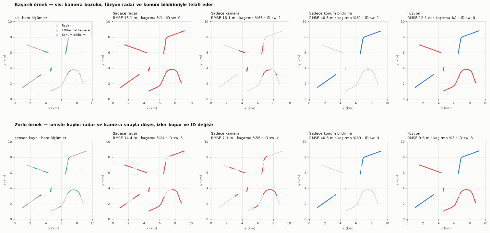
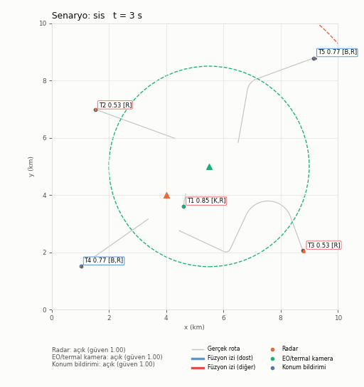
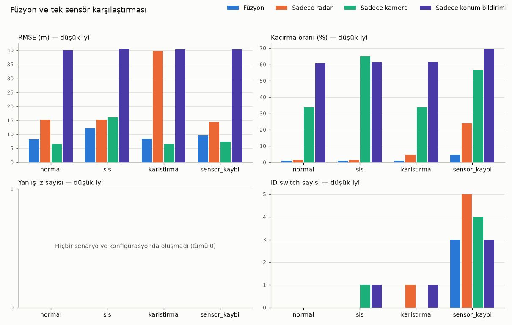

# Çok Sensörlü Veri Füzyonu ile Harekât Sahasında Durumsal Farkındalık

Radar, EO/termal kamera ve konum bildirimi sensörlerinden gelen simüle edilmiş
konum ölçümlerini birleştirerek tek bir **ortak durum resmi** oluşturan ve
füzyonun tek sensöre göre kazancını ölçen bir Python projesi.



*Üst satır (başarılı örnek, sis): Kamera sisten etkilenince tek başına hedeflerin
%65'ini kaçırıyor. Füzyon radar ve konum bildirimiyle bu açığı kapatıyor ve en
düşük RMSE'yi veriyor. Alt satır (zorlu örnek, sensör kaybı): Radar ve kamera
150-170 s arasında aynı anda kapalı kalıyor. Bu sürede sadece dost birlikler
izlenebiliyor; diğer hedeflerin izleri kopuyor ve geri geldiklerinde yeni ID
alıyor. Kırmızı: dost olmayan iz, mavi: dost iz, gri: gerçek rota.*

## Amaç

- 10 km x 10 km'lik bir sahada hareket eden 5 hedefi (2'si dost) farklı
  özelliklere sahip üç sensörle izlemek,
- sensör ölçümlerini zaman, bias ve güven açısından hizalayıp tek bir iz
  listesinde birleştirmek,
- füzyonun tek sensörlere göre kazancını dört senaryoda (normal, sis,
  karıştırma, sensör kaybı) sayısal olarak göstermek.

## Saha ve sensörler

| Hedef | Tür | Rota |
|---|---|---|
| Araç-1 | diğer | düz, sabit 10 m/s |
| İHA-1 | diğer | 22 m/s, uzun sola dönüş ve ardından sağa kırılma |
| İnsan Grubu | diğer | 1.5 m/s, hafif kıvrımlı |
| Dost Araç | **dost** | düz, hız değiştiren (8 → 16 → 5 m/s) |
| Dost İHA | **dost** | 18 m/s, 60° dönüş, ardından yavaşlama |

| Sensör | Konum / menzil | Gürültü (1σ) | Hız | Gecikme | Özel durum |
|---|---|---|---|---|---|
| Radar | (4, 4) km, 8 km | 12 m + 2 m/km | 1 Hz | 0.6-0.7 s | %90 tespit, tarama başına ~0.5 yanlış alarm |
| EO/termal kamera | (5.5, 5) km, 3.5 km | 3 m + 4 m/km | 5 Hz | 0.3-0.35 s | sis: menzil x0.65, gürültü x3, tespit %50 |
| Konum bildirimi | sadece dostlar | 3 m | 0.5 Hz | 1.5-1.7 s | sabit bias (35, -20) m, kimlik taşır |

Sensörler aynı anda ölçmez (her birinin farklı bir faz kayması vardır). Her
ölçüm, sensörün beyan ettiği nominal gürültü kovaryansını taşır. Sis veya
karıştırma bu beyanı değiştirmez; bozulmayı füzyon merkezinin kendisi fark
etmek zorundadır.

## Yöntem

1. **Zaman senkronizasyonu:** Füzyon merkezi, en büyük gecikmeden uzun sabit
   bir pencere (2 s) kadar geriden çalışır. Pencere içindeki ölçümler alınış
   zamanına göre sıralanır, her taramadan önce bütün izler Kalman tahminiyle
   tam o ana taşınır ve sonunda 0.2 s'lik ortak zaman adımına hizalanır. Bu
   sayede gecikmeli ve sırası bozuk gelen ölçümler doğru anda işlenir.
2. **Bias düzeltme:** Konum bildirimindeki sabit sapma, radar ve/veya kamerayla
   desteklenen olgun izlere göre hesaplanan artıkların ağırlıklı ortalamasıyla
   kestirilir. Kestirim tamamlanana kadar bu ölçümler izi güncellemez; sadece
   kimlik etiketi ve bias örneği sağlar.
3. **İz ilişkilendirme:** Mahalanobis kapılama (χ², %99.9) ve Macar algoritması
   (`scipy.optimize.linear_sum_assignment`) kullanılır. Atanmayan ölçümden
   aday iz başlatılır; güven ağırlıklı 3 vuruşla iz onaylanır. Aday iz 2.5 s,
   onaylı iz 6 s güncellenmezse silinir. Çakışan çift izler birleştirilir.
4. **Kalman filtresi:** Sabit hız modeli kullanılır; durum `[x, y, vx, vy]`,
   süreç gürültüsü beyaz ivme σ = 1 m/s².
5. **Sensör güveni ve çelişki çözümü:** Her sensör için normalize inovasyon
   karesinin (NIS) hareketli ortalaması tutulur. Ortalama tolerans değerini (4)
   aşarsa sensörün güveni düşer ve ölçüm kovaryansı `R / güven` olarak
   büyütülür. Böylece karıştırılan radar ya da sisteki kamera, çelişkide daha
   az söz sahibi olur. Güveni düşük sensörün vuruşları da onaya daha az katkı
   verir, bu da karıştırmanın ürettiği sahte izleri engeller.
6. **İz güven skoru:** `1 - Π(1 - katkı_s · güven_s · e^{-Δt_s/5})`. Her iz, son
   3 saniyede kendisini destekleyen sensörlerin listesini taşır (animasyonda
   `[R,K,B]` = radar, kamera, konum bildirimi).

**Değerlendirme:** Füzyon zamanında her saniye onaylı izler gerçek hedeflere
Macar algoritmasıyla eşlenir (eşik 250 m).

- **RMSE:** Eşleşen iz-hedef çiftlerinin konum hatası.
- **Kaçırma oranı:** İz atanmamış (hedef, an) çiftlerinin oranı.
- **Yanlış iz:** Ömrünün yarısından fazlasında hiçbir hedefe eşlenmeyen iz.
- **ID switch:** Bir hedefi izleyen iz kimliğinin değişmesi.

Tek sensör sonuçları, aynı füzyon hattının sadece o sensörle çalıştırılmasıyla
elde edilir.

## Kurulum

```bash
git clone <depo-adresi>
cd fusion-demo
python -m pip install -r requirements.txt
```

Python 3.10+ ve numpy, scipy, matplotlib, pillow (pytest testler için) gerekir.

## Çalıştırma

```bash
python main.py --senaryo sis        # tek senaryo: normal | sis | karistirma | sensor_kaybi
python main.py --hepsi              # tüm senaryolar (~1 dk)
python main.py --hepsi --gif-yok    # animasyonsuz, hızlı
python -m pytest                    # birim testleri
```

Çıktılar `results/` klasörüne yazılır: `<senaryo>.gif`, `karsilastirma.png`,
`ozet.png`, `sonuclar.json`, `sonuclar.md`. Tüm rastgelelik `seed=42` ile
sabittir, sonuçlar her çalıştırmada aynıdır.

## Örnek animasyon



Gri çizgiler gerçek rotaları, küçük renkli noktalar son 3 saniyenin ham
ölçümlerini, kalın çizgiler füzyon izlerini (ID, güven skoru, destekleyen
sensörler) gösterir. Kesikli daireler sensör menzilleridir; sis altında kamera
dairesi küçülür, kapalı sensör noktalı gri çizilir. Diğer senaryolar:
[normal](results/normal.gif) · [karistirma](results/karistirma.gif) ·
[sensor_kaybi](results/sensor_kaybi.gif)

## Sonuçlar

| Senaryo | Konfigürasyon | RMSE (m) | Kaçırma oranı | Yanlış iz | ID switch |
|---|---|---:|---:|---:|---:|
| normal | Sadece radar | 15.1 | %1.3 | 0 | 0 |
| normal | Sadece kamera | 6.5 | %33.9 | 0 | 0 |
| normal | Sadece konum bildirimi | 40.1 | %60.8 | 0 | 0 |
| normal | **Füzyon** | **8.2** | **%1.1** | 0 | 0 |
| sis | Sadece radar | 15.1 | %1.3 | 0 | 0 |
| sis | Sadece kamera | 16.1 | %65.2 | 0 | 1 |
| sis | Sadece konum bildirimi | 40.5 | %61.2 | 0 | 1 |
| sis | **Füzyon** | **12.1** | **%1.1** | 0 | **0** |
| karistirma | Sadece radar | 39.7 | %4.6 | 0 | 1 |
| karistirma | Sadece kamera | 6.6 | %33.8 | 0 | 0 |
| karistirma | Sadece konum bildirimi | 40.4 | %61.5 | 0 | 1 |
| karistirma | **Füzyon** | **8.4** | **%1.1** | 0 | **0** |
| sensor_kaybi | Sadece radar | 14.4 | %23.8 | 0 | 5 |
| sensor_kaybi | Sadece kamera | 7.3 | %56.5 | 0 | 4 |
| sensor_kaybi | Sadece konum bildirimi | 40.3 | %69.4 | 0 | 3 |
| sensor_kaybi | **Füzyon** | **9.6** | **%4.6** | 0 | 3 |



### Yorum

- **Kapsama:** Füzyon her senaryoda en düşük kaçırma oranını veriyor (%1-5).
  Tek sensörlerde bu oran %1-70 arasında.
- **Doğruluk:** Füzyon her senaryoda radar ve konum bildiriminden daha doğru.
  **Sis senaryosunda bütün tek sensörlerden daha düşük RMSE veriyor** (12.1 m;
  en iyi tek sensör radar 15.1 m).
- **Kamera ile karşılaştırma:** Normal, karıştırma ve sensör kaybında sadece
  kameranın RMSE'si daha düşük görünüyor. Ancak kamera bu sürede hedeflerin
  %34-57'sini hiç görmüyor; RMSE'si sadece menzili içindeki yakın hedeflerden
  hesaplanıyor. Füzyon ise uzak hedefleri de (radarın daha gürültülü
  ölçümleriyle) izliyor. RMSE'yi kaçırma oranıyla birlikte okumak gerekir.
- **Bias düzeltme:** Konum bildirimindeki (35, -20) m sapma her senaryoda
  ~(39, -19) m olarak kestiriliyor. Kalan hata ~4 m; tek başına konum
  bildiriminin hatası ise ~40 m.
- **Karıştırma:** Radarın güveni karıştırma süresince ~0.1'e düşüyor. Radarın
  tek başına RMSE'si 39.7 m'ye çıkarken füzyon 8.4 m'de kalıyor. Güven ağırlıklı
  onay sayesinde yoğun yanlış alarmlar sahte ize dönüşmüyor.
- **Sensör kaybı (zayıf nokta):** Radar ve kamera 150-170 s arasında aynı anda
  kapalı. Dost olmayan hedeflerin izleri 6 s sonra siliniyor ve sensörler geri
  gelince yeni ID ile başlıyor (3 ID switch).

## Proje yapısı

```
fusion-demo/
  main.py                  komut satırı, senaryo koşturma, tablo ve grafik üretimi
  src/saha.py              saha ve hedef rotaları
  src/sensorler.py         sensör modelleri ve senaryo olayları
  src/kalman.py            sabit hız Kalman filtresi
  src/iliskilendirme.py    Mahalanobis kapılama + Macar algoritması
  src/fuzyon.py            füzyon merkezi (senkronizasyon, bias, güven, iz yönetimi)
  src/degerlendirme.py     RMSE, kaçırma, yanlış iz, ID switch
  src/gorsel.py            GIF animasyon, karşılaştırma ve özet figürleri
  tests/                   pytest birim testleri
  results/                 üretilen çıktılar
```

## Varsayımlar ve tasarım kararları

- Sensörler doğrudan kartezyen (x, y) konum ölçer. Gürültü mesafeyle doğrusal
  artar.
- Konum bildirimi mesajı birliğin kimliğini taşır. Füzyon bunu dost/diğer
  etiketi için ve farklı kimlikli ölçümün yanlış ize atanmasını engellemek
  için kullanır.
- Füzyon 2 s geriden çalışır (sabit gecikme penceresi). Durum resmi ve
  değerlendirme bu hizalanmış zamana göredir.
- Sis 60. saniyeden itibaren, karıştırma 80-220 s, sensör kaybı radar
  100-170 s, kamera 150-230 s, konum bildirimi 200-260 s aralığında etkindir.
- Karıştırmada yanlış alarmların %70'i karıştırıcı konumu (7, 6.5) km
  çevresinde yoğunlaşır.

## Gelecek çalışmalar

- Manevralı hedefler için IMM (sabit hız + koordineli dönüş) filtre.
- Kutupsal (menzil-açı) radar ölçüm modeli ve EKF/UKF.
- Gecikmeli ölçümleri pencere beklemeden işlemek için sırası bozuk ölçüm
  (OOSM) güncellemesi ile gerçek zamanlı çıktı.
- Uzun sensör kesintilerinden sonra kimlik korumak için iz yeniden bağlama
  (track re-identification).
- Yoğun yanlış alarm ortamı için JPDA / MHT ilişkilendirme.
- Sensör konumlarındaki ve zaman damgalarındaki hataların da kestirildiği tam
  sensör kaydı (registration).
- Monte Carlo koşuları ile sonuçların güven aralıklarıyla verilmesi.
